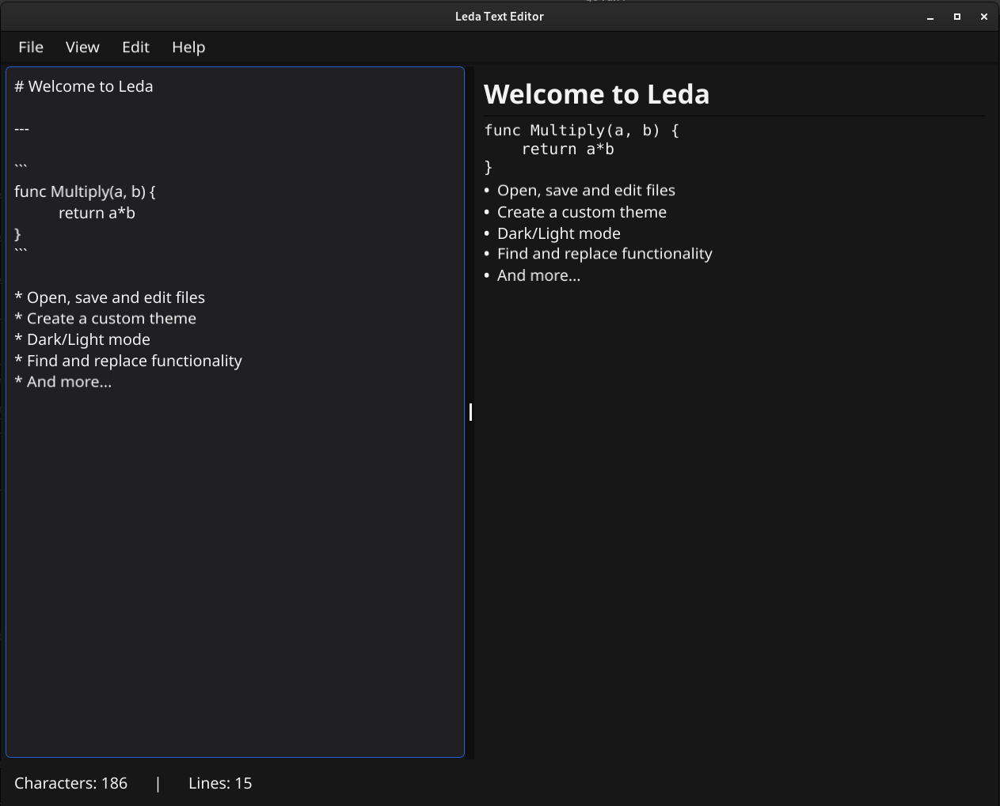

# Leda - A Text Editor Built with Fyne

Leda is a modern and lightweight text editor built using the Fyne framework. It offers a simple, intuitive interface for editing text files while providing powerful functionality under the hood.

## Features

- Basic text editing functions (cut, copy, paste, undo, redo)
- Cross-platform support (Linux, macOS, Windows)
- Clean and minimalistic design
- Autosave functionality
- Dark/Light mode
- Markdown parsing
- Open, edit and save files
- Custom UI presets/layouts

## Build Showcase



---

## Requirements

Before you start developing with Leda, make sure you have the following installed:

- [Go](https://golang.org/dl/) (Version 1.18 or higher)
- [Fyne](https://fyne.io/) framework (can be installed using `go get`)

## Getting Started

### Clone the Repository

To get started, first clone the repository to your local machine:

```bash
git clone git@github.com:Leda-Editor/Leda-Text-Editor.git
cd Leda-Text-Editor
```

Intall any dependencies required

```bash
go get fyne.io/fyne/v2
```

You can build the project with a very simple command from the root of this directory with:

```bash
go build .
# Or this if you do not want an executable
go run .
```

## License

This project is licensed under the Apache 2.0 License - see the LICENSE file for details
